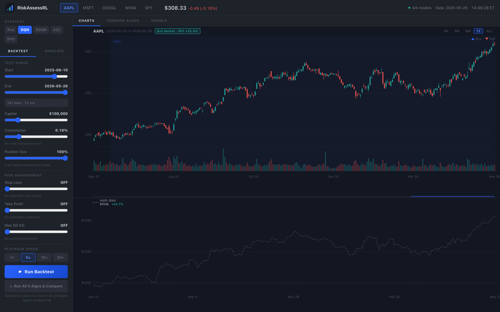

# RiskAssessRL

> Reinforcement learning platform for risk-adjusted trading strategy simulation — with a TradingView-style live dashboard.

[](https://risk-assess-rl.vercel.app)
[](https://riskassessrl-production.up.railway.app/docs)
[](https://python.org)
[](tests/)

**▶ Live demo: [risk-assess-rl.vercel.app](https://risk-assess-rl.vercel.app)** — UI on Vercel, API on Railway ([API docs](https://riskassessrl-production.up.railway.app/docs)). The backend may cold-start on the first request, so give it a few seconds to wake up.

---

## What It Does

Five reinforcement learning agents (Random, DQN, DDQN, A2C, PPO) trade a configurable stock portfolio against historical OHLCV data. A live dashboard streams trades step-by-step over WebSocket, renders them on a custom SVG candlestick chart (with Bollinger Band overlays and trade markers), plots portfolio equity vs buy-and-hold, and displays Sharpe ratio, max drawdown, win rate, and alpha — in real time.



*Charts tab — backtest + risk-management controls on the left, AAPL candlesticks with a market-regime badge up top, portfolio-vs-buy-&-hold below. Two more tabs (Compare Algos, Models) sit alongside it.*

---

## Architecture

```
┌────────────────────────────────────────────────────────────────┐
│                        docker-compose                          │
│                                                                │
│  ┌─────────────────┐  ┌──────────────────┐  ┌─────────────┐  │
│  │    frontend      │  │     backend      │  │   mlflow    │  │
│  │  React + Vite    │  │    FastAPI        │  │  tracking   │  │
│  │  :3000           │  │    :8000         │  │  :5000      │  │
│  │  hand-built SVG  │  │  REST + WS       │  │  mlruns/    │  │
│  │  candlestick &   │  │  RL agents       │  │             │  │
│  │  portfolio charts│  │  SL/TP/DD logic  │  │             │  │
│  └────────┬─────────┘  └────────┬─────────┘  └─────────────┘  │
│           │   WebSocket /ws/simulate           │               │
│           └───────────────────────────────────┘               │
└────────────────────────────────────────────────────────────────┘
                              │
          ┌───────────────────┴──────────────────┐
          │             pipeline/                 │
          │  ingest → features → validate         │
          │  • 5 tickers: AAPL MSFT GOOGL NVDA SPY│
          │  • Parallel ThreadPoolExecutor        │
          │  • APScheduler: daily 18:00 ET (AAPL) │
          └──────────────────────────────────────┘
                              │
          ┌───────────────────┴──────────────────┐
          │  data/                                │
          │  raw/{TICKER}.csv                     │
          │  processed/{TICKER}_features.csv      │
          └──────────────────────────────────────┘
```

---

## Quickstart

Common workflows are wrapped in a **`Makefile`** (`make help` lists them all):

```bash
make install    # Python + frontend deps
make data       # download + feature-engineer AAPL MSFT GOOGL NVDA SPY
make train      # train all agents (DQN/DDQN 2000 eps, A2C/PPO 3000 eps)
make evaluate   # regenerate results/comparison.json
make test lint  # run tests + lint (same checks as CI)
make backend    # FastAPI on :8000   (separate terminal: make frontend → :3000)
```

The explicit commands behind those targets:

### Local (dev mode — fastest)

```bash
# 1. Create and activate virtual environment
python3 -m venv ~/myenv && source ~/myenv/bin/activate

# 2. Install Python deps
pip install -r requirements.txt

# 3. Run the multi-asset data pipeline (downloads AAPL MSFT GOOGL NVDA SPY in parallel)
PYTHONPATH=. python -m pipeline.ingest

# 4. Train all agents (default episode counts; increase for better A2C/PPO convergence)
PYTHONPATH=. python -m src.train --algo DQN  --episodes 2000 &
PYTHONPATH=. python -m src.train --algo DDQN --episodes 2000 &
PYTHONPATH=. python -m src.train --algo A2C  --episodes 3000 &
PYTHONPATH=. python -m src.train --algo PPO  --episodes 3000 &
wait

# 5. Evaluate → results/comparison.json
#    (also available: --mode walkforward, --mode generalization)
PYTHONPATH=. python -m src.evaluate --mode comparison

# 6. Start backend
PYTHONPATH=. uvicorn backend.main:app --host 0.0.0.0 --port 8000 --reload

# 7. Start frontend (separate terminal)
cd frontend && npm install && npm run dev
```

Open **http://localhost:3000** to see the dashboard — or skip local setup entirely and use the [live demo](https://risk-assess-rl.vercel.app).

### Docker

```bash
# After running steps 1–5 above to populate data/ and models/:
docker-compose up --build
```

Services:
- Dashboard: http://localhost:3000
- API + Swagger docs: http://localhost:8000/docs
- MLflow UI: http://localhost:5000

### Live deployment (Vercel + Railway)

The hosted demo runs as two independent services:

| Layer | Host | URL |
|---|---|---|
| Frontend — static Vite build | Vercel | <https://risk-assess-rl.vercel.app> |
| Backend — FastAPI + WebSocket | Railway | <https://riskassessrl-production.up.railway.app> |

The frontend reads its API base URL from `VITE_API_URL` at build time (see
`frontend/src/config.js`); on Vercel that variable is set to the Railway URL, and
the WebSocket URL is derived from it (`https` → `wss`). The backend image bundles
the trained model weights and the processed data, so the demo needs no external
database. Depending on the hosting plan the backend may cold-start when idle, so
the first request after a pause can take a few seconds.

---

## Project Structure

```
RiskAssessRL/
├── pipeline/
│   ├── ingest.py        # yfinance download → data/raw/; run_all() for 5 tickers in parallel
│   ├── features.py      # MA20/50, RSI-14, MACD, Bollinger Bands, ATR-14, Support/Resistance
│   ├── validate.py      # Pandera schema: nulls, price > 0, RSI in [0,100], monotonic dates
│   └── scheduler.py     # APScheduler BlockingScheduler — runs AAPL pipeline daily at 18:00 ET
├── src/
│   ├── env.py           # StockTradingEnv: 50-day window, 9 features, Discrete(3), commission
│   ├── agents.py        # RandomAgent, DQNAgent, DoubleDQNAgent, A2CAgent, PPOAgent
│   ├── train.py         # MLflow-instrumented training; CLI: python -m src.train --algo X
│   └── evaluate.py      # sharpe_ratio, max_drawdown, total_return_pct, run_comparison()
├── backend/
│   ├── main.py          # FastAPI: REST + WebSocket; SL/TP/max-DD kill switch; multi-ticker
│   └── Dockerfile
├── frontend/
│   ├── Dockerfile
│   └── src/
│       ├── App.jsx                   # Root: WebSocket state, B&H computation, layout
│       └── components/
│           ├── Topbar.jsx            # 48px topbar: ticker pills, price, clock, status
│           ├── LeftPanel.jsx         # Strategy selector, backtest params, risk controls
│           ├── TradingChart.jsx      # Custom SVG candlestick + volume + Bollinger Bands
│           ├── PortfolioChart.jsx    # Custom SVG line chart: portfolio vs B&H
│           ├── ComparisonTable.jsx   # All-algo table with best-value highlighting
│           └── AlgorithmsTab.jsx     # Per-algo cards: architecture, metrics, apply settings
├── tests/
│   ├── test_env.py        # 13 tests: obs shape, capital, actions, step log, split
│   ├── test_pipeline.py   # 14 tests: indicators, schema validation, edge cases
│   └── test_api.py        # 17 tests: health, algorithms, data, simulate endpoints
├── docs/
│   ├── screenshots/      # Dashboard screenshot embedded in this README
│   └── archive/          # Original course notebook, prototype weights, report
├── data/
│   ├── raw/              # Raw OHLCV CSVs from yfinance
│   └── processed/        # Feature-engineered CSVs (committed as source of truth)
├── models/               # Trained .pth weights + reward-curve PNGs (committed)
├── results/
│   ├── comparison.json     # Single-split evaluation (all agents + benchmarks)
│   ├── walkforward.json    # 5-fold walk-forward results
│   └── generalization.json # Zero-shot cross-asset results
├── .github/workflows/
│   └── ci.yml            # Lint + tests + frontend build on push / PR
├── Makefile              # Common workflows — run `make help`
├── pyproject.toml        # Project metadata + ruff config
├── pytest.ini
├── docker-compose.yml
└── requirements.txt
```

---

## Algorithms

| Algorithm | Type | Replay Buffer | Architecture | Default Training |
|---|---|---|---|---|
| **Random** | Baseline | — | Uniform random over {Buy, Sell, Hold} | None |
| **DQN** | Value-based, off-policy | 10 000 transitions | 3-layer MLP (451→64→64→3), ε-greedy | 2 000 episodes |
| **DDQN** | Value-based, off-policy | 10 000 transitions | DQN net + decoupled target (Double-DQN) | 2 000 episodes |
| **A2C** | Policy gradient, on-policy | — | Shared trunk (451→256→256) → actor + critic heads, **action masking** | 3 000 episodes |
| **PPO** | Policy gradient, on-policy | — | Actor-critic trunk (451→256→256), clipped ratio ε=0.2, **action masking** | 3 000 episodes |

**Observation**: 50-day window × 9 Z-scored features + 1 position flag = **451-dimensional** vector

**Features**: MA\_20, MA\_50, RSI\_14, MACD, BB\_upper, BB\_lower, ATR\_14, Support, Resistance

**Actions**: `0` = Buy (deploy `position_size × capital`), `1` = Sell all, `2` = Hold

**Reward**: `(portfolio_Δ / initial_capital) × 10` − `std(recent_returns) × 0.05 × risk_aversion` − `0.1` on invalid action

**Action masking** (A2C/PPO only): invalid actions — Sell with no position, Buy with
insufficient cash — are removed from the policy distribution at both training and
inference, so on-policy agents can never be lured into the always-Hold trap by the
invalid-action penalty. DQN/DDQN are trained unmasked (ε-greedy + replay handles it).

---

## Algorithm Results (AAPL, 20% test split, $100 000 starting capital)

| Algorithm | Return | Sharpe | Max Drawdown | vs AAPL B&H | vs SPY B&H |
|---|---|---|---|---|---|
| Random* | +16.38% | 1.091 | −10.9% | −36.3pp | −9.4pp |
| DQN | +32.60% | 2.062 | −11.0% | −20.1pp | +6.8pp |
| DDQN | +35.51% | 1.824 | −13.8% | −17.2pp | +9.7pp |
| **A2C** | **+59.58%** | **3.179** | **−10.1%** | **+6.9pp** | **+33.8pp** |
| PPO | +13.79% | 0.930 | −11.1% | −38.9pp | −12.0pp |
| SPY B&H | +25.78% | — | — | — | — |
| AAPL B&H | +52.70% | — | — | — | — |

A2C is the only agent to beat AAPL buy-and-hold; A2C, DQN and DDQN all beat the SPY benchmark on a risk-adjusted basis. `*` Random is a single stochastic rollout and is inherently noisy run-to-run — see **Walk-Forward Validation** below for the robust mean ± std picture.

> **Why A2C/PPO were `0.00%` before — and the fix.** On-policy agents initially
> collapsed to an always-Hold policy (0% return) *regardless of episode count*.
> The environment's −0.1 invalid-action penalty (Sell with no position, Buy with
> no cash) makes Hold the only action that is never penalised, so on-policy
> learning converges to it before it ever discovers a profitable buy→hold→sell
> sequence — and more training made it *worse*. The fix is **action masking**:
> invalid actions are masked out of the policy distribution so they can never be
> sampled, combined with advantage normalisation and entropy annealing
> (0.05 → 0.005). With masking, A2C becomes the strongest agent (+59.6%, Sharpe
> 3.18) and PPO converges to a conservative single-position strategy (+13.8%).
> DQN/DDQN never needed masking — ε-greedy exploration with a replay buffer
> escapes the trap on its own. These are single-split numbers; the walk-forward
> section stress-tests them across five sequential regimes.

---

## Walk-Forward Validation

A single 80/20 split reports **one** test period — and one period can flatter a
model that happened to suit that regime. Walk-forward validation is the honest
alternative: the series is cut into six sequential blocks, and each fold trains on
**all prior blocks** and tests on the **next, unseen** block, rolling forward.
Five folds, each evaluated on a held-out ~10-month window it never trained on.
(Reproduce: `python -m src.evaluate --mode walkforward`; saved to
`results/walkforward.json`.)

| Algorithm | Return (mean ± std) | Sharpe (mean ± std) | Losing folds |
|---|---|---|---|
| Random | +2.38% ± 9.54 | +0.16 ± 0.84 | 1 / 5 |
| DQN | +17.78% ± 16.38 | +1.87 ± 1.44 | 1 / 5 |
| DDQN | +8.08% ± 16.96 | +0.38 ± 1.45 | 2 / 5 |
| **A2C** | +16.90% ± **10.12** | +1.08 ± 0.61 | **0 / 5** |
| **PPO** | **+19.95%** ± 11.42 | +1.57 ± 0.80 | **0 / 5** |

Held-out test windows: fold 1 `2022-05 → 2023-03`, fold 2 `2023-03 → 2023-12`,
fold 3 `2023-12 → 2024-10`, fold 4 `2024-10 → 2025-07`, fold 5 `2025-08 → 2026-05`.

**What this reveals that the single split hid:**
- **Random averages ~0** across folds — confirming its lucky +16% on the single
  split was regime noise, and that the harness itself is sound.
- **DDQN, the single-split star (+35%), is the least reliable across time**
  (Sharpe 0.38 ± 1.45, two losing folds). Its headline number was partly luck.
- **The masked policy-gradient agents (A2C, PPO) are the most robust** — neither
  had a single losing fold; A2C has the lowest variance, PPO the best mean return
  with a strong, stable Sharpe. Masking didn't just un-break them — it produced
  the most regime-general strategies in the suite.

> Episode counts here (400 value / 300 policy per fold) are lower than the
> headline single-split models (2 000 / 3 000) to keep the 20-run sweep
> tractable, so absolute returns run a little lower — but the **cross-regime
> ranking** is the point, not the absolute level.

---

## Cross-Asset Generalization (Zero-Shot)

Does the agent learn a transferable trading pattern, or does it just memorise
one stock? To find out, the **DDQN agent trained only on AAPL** is run
zero-shot — no retraining, no fine-tuning — on the held-out test slice of every
other ticker. (Reproduce with `python -m src.evaluate --mode generalization`;
saved to `results/generalization.json`.)

| Ticker | DDQN Return | DDQN Sharpe | Max DD | Buy & Hold | Verdict |
|---|---|---|---|---|---|
| **AAPL** (trained) | +35.51% | +1.82 | −13.8% | +52.70% | reference |
| GOOGL | +62.30% | +2.41 | −20.3% | +118.19% | transfers strongly |
| NVDA | +16.52% | +0.66 | −20.2% | +49.23% | transfers |
| SPY | +11.40% | +0.93 | −9.1% | +25.78% | transfers |
| MSFT | −17.43% | −1.02 | −33.8% | −10.95% | fails to transfer |

**Read:** the AAPL-trained policy transfers *positively* (positive return **and**
Sharpe) to three of four unseen tickers, collapsing only on MSFT. It does not
beat each asset's buy-and-hold during these strong bull runs — it stays
risk-managed and partly in cash — but a Sharpe of 2.4 on GOOGL and 0.9 on the
broad market (SPY), from a model that never saw those series, is evidence it
learned a generalisable momentum/mean-reversion signal rather than overfitting
to AAPL. Generalisation is **partial, not universal** — MSFT's different regime
breaks it, which is the honest result.

---

## Risk Controls (Inference-Time)

All risk parameters are applied as **action overrides at inference time** — they do not require retraining.

| Control | Effect |
|---|---|
| **Stop Loss** | Forces a sell when current price falls X% below entry price |
| **Take Profit** | Forces a sell when current price rises X% above entry price |
| **Max Drawdown Kill Switch** | Halts simulation when portfolio drawdown from peak exceeds threshold |
| **Position Size** | Fraction of available capital deployed on each Buy signal (0.1 – 1.0) |
| **Risk Aversion** | Scales the volatility penalty in the reward signal at inference time |
| **Custom Test Range** | Slider-selectable start/end date window within the available history |

---

## API Reference

| Method | Endpoint | Description |
|---|---|---|
| `GET` | `/health` | Status, loaded model names, available tickers |
| `GET` | `/api/tickers` | List of tickers with available processed data |
| `GET` | `/api/algorithms` | All-algo metrics from `results/comparison.json` |
| `GET` | `/api/data?ticker=AAPL` | OHLCV for all available bars |
| `POST` | `/api/backtest` | Full simulation with metrics; supports SL/TP/DD/date range |
| `POST` | `/api/run_all_backtest` | Runs all 5 algos under identical params; returns comparison + benchmarks |
| `WS` | `/ws/simulate` | Real-time step streaming: speed control, SL/TP/DD, date range |

Interactive docs: **http://localhost:8000/docs** locally, or **[live on Railway](https://riskassessrl-production.up.railway.app/docs)**.

---

## Pipeline

```bash
# Single ticker
PYTHONPATH=. python -m pipeline.ingest --ticker AAPL

# All 5 tickers in parallel (AAPL MSFT GOOGL NVDA SPY)
PYTHONPATH=. python -m pipeline.ingest

# Start the daily scheduler (18:00 ET, AAPL)
PYTHONPATH=. python -m pipeline.scheduler
```

The scheduler runs AAPL only. To schedule additional tickers, edit `pipeline/scheduler.py`.

---

## MLflow Experiment Tracking

Each `src.train` run automatically logs to MLflow:

| Category | Items |
|---|---|
| **Parameters** | `algo`, `episodes`, `gamma`, `lr`, `hidden_size`, `batch_size` |
| **Metrics (every 50 eps)** | `mean_reward`, `portfolio_value` |
| **Final metrics** | `final_portfolio_value`, `total_return_pct`, `sharpe_ratio`, `max_drawdown` |
| **Artifacts** | `{algo}.pth` weights, reward-curve PNG |

```bash
mlflow ui --port 5000   # → http://localhost:5000
```

---

## Tests

```bash
# Run all tests
PYTHONPATH=. pytest tests/ -v

# Individual suites
PYTHONPATH=. pytest tests/test_env.py       # 13 tests — Gymnasium environment
PYTHONPATH=. pytest tests/test_pipeline.py  # 14 tests — features + Pandera schema
PYTHONPATH=. pytest tests/test_api.py       # 17 tests — FastAPI endpoints
```

---

## Design Decisions

**Why a 50-day observation window?**
50 bars (~2.5 months) captures medium-term trend structure. Shorter windows lose trend context; longer windows increase the observation dimension and slow convergence disproportionately.

**Why discrete all-in / all-out actions?**
Continuous position sizing requires actor-critic methods designed for continuous action spaces (DDPG, SAC). Discrete Buy/Sell/Hold keeps the action space minimal, lets DQN/DDQN apply directly, and still produces interpretable trading signals.

**Why Z-score normalisation per split?**
Normalising each split separately prevents data leakage (no test-period statistics leak into training) and ensures the agent sees consistently-scaled inputs regardless of absolute price level.

**Why action-override risk controls rather than reward shaping?**
Stop-loss/take-profit as reward penalties would require retraining every time a user adjusts thresholds. Applying them as inference-time action overrides inside `_run_simulation` means any threshold is available instantly without touching the trained weights.

**Why hand-built SVG charts?**
The charts required precise control over candle geometry, trade-marker overlays, and ResizeObserver-driven re-layout that charting library abstractions made harder, not easier. Custom SVG is ~300 lines and has zero runtime dependencies.

**Why did A2C/PPO need action masking when DQN/DDQN didn't?**
On-policy agents learn only from actions they actually sample. The env penalises invalid actions (−0.1), and Hold is the one action that is *never* invalid — so an on-policy policy minimises penalties by collapsing to Hold before it ever samples enough profitable buy→sell cycles to learn otherwise. More episodes reinforced the collapse rather than escaping it. DQN/DDQN avoid this because ε-greedy forces invalid/exploratory actions into a replay buffer, so their value estimates still learn what trading is worth. Masking invalid actions out of the policy distribution removes the trap entirely; with it, A2C goes from 0% to +59.6% (Sharpe 3.18).

---

## Limitations & Honest Notes

This is a research and engineering project, not a trading system or financial advice.

- **Not live-trading-ready.** No broker integration, no live data feed, no order
  execution. Everything here is a historical backtest on daily bars.
- **Backtests flatter reality.** Trades fill at the daily close with no slippage
  or market impact beyond a flat commission — real fills would be worse.
- **Single-split numbers are optimistic.** A model can shine on one test window
  and be mediocre across regimes — which is exactly what the walk-forward results
  show for DDQN. Treat the walk-forward mean ± std as the honest signal, not the
  single-split table.
- **Favourable universe.** The tickers are a handful of large-cap names that
  trended up over the sample; results won't generalise to all markets, and the
  zero-shot section shows transfer is partial (it fails on MSFT).
- **Deliberately simple action space.** Buy-all / sell-all / hold, with a single
  global position-size fraction — not per-trade sizing.
- **Laptop-scale training.** Episode counts are set to finish in minutes, not to
  maximise performance.

### What it hopes to achieve

A clean, reproducible, end-to-end RL-for-trading pipeline — data → features →
validated environment → trained agents → honest evaluation (single-split,
walk-forward, zero-shot) → a live dashboard — that is straightforward to read,
run, and extend to new tickers or new agents.

---

## License

Apache-2.0 — see [LICENSE](LICENSE).

## Author

Shubham Sharma - University at Buffalo

*Extended from the original course project (see `docs/archive/original_course_project/`).*
